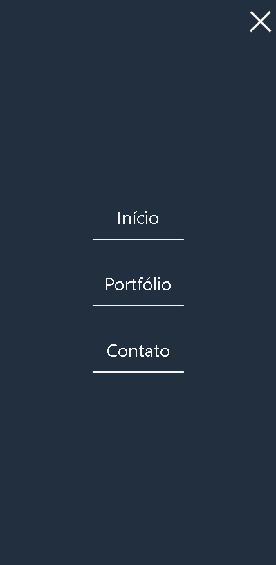

<main style="text-align:center">
    <h1><strong>Portfólio</strong></h1>
    <h3><strong>Criado utilizando HTML, CSS e JS || 100% responsívo</strong></h3>
    
Portfólio para uso de divulgação de projetos próprios, referência acadêmica e profissional.

    <h4>Projetos anexados:</h4>
    <ul>
        <li>Wildlife</li>
        <li>Login page</li>
        <li>Jogo da memória</li>
        <li>Jogo da velha</li>
        <li>Stopwatch</li>
        <li>Cartão de visita</li>
    </ul>
    

    <h2 style="margin-bottom: 20px">Versão para Desktop</h2>
    
    

    <h2 style="margin-bottom: 20px">Versão para disposivos móveis</h2>
    
    
    

    
Site anexado na bio do perfil

    <h3><a href="https://guilhermebittelbrunn.github.io/jogo-da-memoria/"> Clique aqui para ver o site</a></h3>
    
Created by: Guilherme Bittelbrunn

</main>

